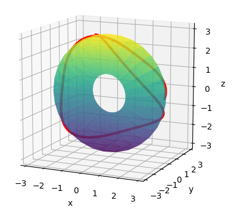

# Riemannian geometry tool

The purpose of this tool is to numerically calculate geodesic paths on surfaces in space. The program allows for the calculation of geodesics on a variety of surfaces and provides output in the form of a graphical plot. Additionally, it allows for obtaining an analytical expression of the Christoffel symbols and in the future, it will also provide the Gaussian curvature.

